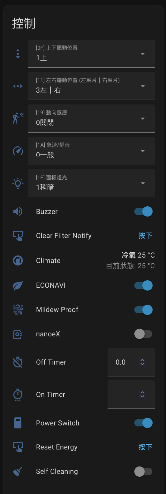

# taixia-pa — ESPHome TaiSEIA 元件 (Panasonic 客製版)

Fork 自 [tsunglung/taixia](https://github.com/tsunglung/taixia)。原作者
已完成 TaiSEIA 101 協定核心、多廠牌支援、HomeAssistant
整合等基礎建設，感謝原作者貢獻。

本 fork **針對 Panasonic 冷氣**做了一些修正與行為調整，部分行為轉成Panasonic 慣例 (詳見下方)。

Python component 名稱**仍為 `taixia`**，原本 YAML 只需要改 `external_components` 的 `source` 即可切到此版本。

---

## 修改後在HA的內容:



---

## 改了哪些東西

### Bug 修正
- preset `NONE` 會 reset ECO / SELF_CLEANING / AIR_PURIFIER —
  這些功能改為獨立 switch，preset NONE 不再碰它們以免衝突。
- preset 回讀只反映實際開啟的 BOOST / SLEEP / ACTIVITY，移除
  ECO / AWAY / COMFORT / HOME 的回讀 (避免設定到不支援的 preset)。

### Schema 強化
- `select` 的 `options:` 接受 **list 或 dict** 兩種寫法：
  - **list** (向後相容)：從預設標籤過濾出子集。
  - **dict** (新)：完全 override 標籤對應的數值，可直接寫中文標籤

### 新增 entity
- `select.swing_vertical_level` (H'0F) — Panasonic 只有 level，沒 boolean。
- `select.quick_mode` (H'1A) — Panasonic 把 H'1A 用成 3-state
  (`0:一般 / 1:急速 / 2:靜音`)，原本 boolean switch 表達不出來。

### Panasonic 行為調整
- **`climate.swing_mode` 改成純反饋**。Panasonic 沒有 H'0E / H'10
  (boolean swing)，只有 H'0F / H'11 (level)。原本 control() 會寫
  H'0E / H'10 / H'11 是無效或會 clobber 使用者的 level 設定，現在改
  成只接受 call 但不寫 UART。`handle_response` 仍會根據
  `H'0F == 0` / `H'11 == 0` 算出 swing_mode 顯示。
  → 葉片位置請用新的 `select.swing_vertical_level` /
  `select.swing_horizontal_level` 控制。
- **`select.motion_detect` (H'19) 跟葉片連動** — 詳見下節。

---

## 動向感應 (H'19) 控制邏輯

Panasonic 遙控器按「動向感應」鍵時，AC 內部會自動把上下、左右擺動切到
「自動掃 (level=0)」，這樣感應器才能真正接管葉片方向；關閉時又會把擺動還原。

但**直接寫 H'19 = N，AC 不會有作用**，造成「動向感應好像有開、
但葉片沒動」。本 fork 在 `AirConditionerSelect::control()` 內模擬遙控器行為：

```
動向感應 0 → 非0 (例如選「對人」):
  1. ESP32 記住目前 H'0F / H'11 值 (saved_swing_vert / saved_swing_horiz)
  2. UART 送 H'0F = 0
  3. UART 送 H'11 = 0
  4. publish "level=0 對應 label" 給上下擺動 select  (HA UI 瞬間更新)
  5. publish "level=0 對應 label" 給左右擺動 select  (HA UI 瞬間更新)
  6. UART 送 H'19 = 新值
  7. publish 新 label 給動向感應 select

動向感應 非0 → 0 (選「關閉」):
  1. UART 送 H'19 = 0
  2. UART 送 H'0F = saved_swing_vert (還原)
  3. UART 送 H'11 = saved_swing_horiz (還原)
  4. publish 還原後的 label 給兩個擺動 select
  5. publish 「關閉」label 給動向感應 select

動向感應 非0 → 非0 (例如「對人」→「不對人」):
  - 只送 H'19，不動擺動
```

### 防止誤動作
當 H'19 非 0 (動向感應 active) 時，**上下/左右擺動 select 寫入會被拒絕**：
- `control()` log 出 `Swing change refused: motion_detect is active (H'19=N)`
- 不送 UART
- 把 UI snap 回目前 device 真正的值

要編輯擺動位置請先把動向感應切到「關閉」。

---

## Panasonic 範例 YAML (部分)

完整請參考 ESP32C3-Panasonic-AC.yaml

```yaml
external_components:
  - source: github://xangin/taixia-pa
    components: [ taixia ]

uart:
  id: uart_taixia
  tx_pin: GPIO7   # → AC RX
  rx_pin: GPIO6   # ← AC TX
  baud_rate: 9600

button:
  - platform: safe_mode
    name: Safe Mode Boot
    entity_category: diagnostic
  # Restart is in base.
  - platform: taixia
    type: airconditioner
    get_info:
      name: "Get Info"
    # H'28 寫 0 — 重設累計用電量
    energy_reset:
      name: "Reset Energy"
    # H'12 寫 0 — 取消濾網清潔提示
    filter_clean_notify:
      name: "Clear Filter Notify"

climate:
  - platform: taixia
    id: ac_climate
    name: "Climate"
    update_interval: 10s
    supported_modes:
      - COOL
      - HEAT
      - DRY
      - FAN_ONLY
    supported_fan_modes:
      - LOW
      - MEDIUM
      - HIGH
      - AUTO
    # swing_mode 目前是 feedback only：handle_response 會依 H'0F=0 / H'11=0
    # 計算 VERTICAL/HORIZONTAL/BOTH/OFF，但 control() 不寫入。實際擺動位置用下方
    # select entity 控制。
    supported_swing_modes:
      - VERTICAL
      - HORIZONTAL
      - BOTH
    # ECO/HOME 已改為獨立 switch (power_saving / air_purifier)，從 preset 移除避免
    # 雙重控制。AWAY/COMFORT 在 Panasonic 上不適用。
    supported_presets:
      - NONE
      - BOOST     # H'1A=1 (急速)
      - ACTIVITY  # H'19 任何非 0 (動向感應)
      - SLEEP     # H'05=1 (舒眠)

number:
  - platform: taixia
    type: airconditioner
    off_timer:
      name: "Off Timer"
    on_timer:
      name: "On Timer"

sensor:
  - platform: taixia
    type: airconditioner
    temperature_indoor:
      name: "Temperature Indoor"
    temperature_outdoor:
      name: "Temperature Outdoor"
    operating_current:
      name: "Current"
    energy_consumption:
      state_class: total_increasing
      name: "Energy"
    operating_watt:
      name: "Power"
    # H'29 錯誤訊息顯示功能 — 0=正常，非 0=故障碼
    error_code:
      name: "Error Code"

select:
  - platform: taixia
    type: airconditioner

    # H'1F 機體顯示模式 — Panasonic 實測只 cycle 0/1/2 三段
    # (CNS 規格定義 3="全關"，但這台從遙控按不到，待測強制寫入)
    display_mode:
      id: sel_display_mode
      name: "[1F] 面板燈光"
      options:
        "0最亮": 0
        "1稍暗": 1
        "2稍暗2": 2

    # H'19 動向感應 — Panasonic 4-state cycle: 0→3→1→2→0
    # 0/3 由按鍵設定，1/2 由 AC 內部感測自動填
    motion_detect:
      id: sel_motion_detect
      name: "[19] 動向感應"
      options:
        "0關閉": 0
        "1對人": 1
        "2不對人": 2
        "3自動": 3

    # H'0F 上下擺動段位 — Panasonic 6 段 (0=自動掃, 1~5=固定位置)
    swing_vertical_level:
      id: sel_swing_vert
      name: "[0F] 上下擺動位置"
      options:
        "0自動擺動": 0
        "1上": 1
        "2中上": 2
        "3中": 3
        "4中下": 4
        "5下": 5

    # H'11 左右擺動段位 — Panasonic 8 段 (0=自動掃, 1~7=固定位置)
    swing_horizontal_level:
      id: sel_swing_horiz
      name: "[11] 左右擺動位置 (左葉片｜右葉片)"
      options:
        "0自動擺動": 0
        "1中｜中": 1
        "2右｜左": 2
        "3左｜右": 3
        "4左｜左": 4
        "5左｜中": 5
        "6中｜右": 6
        "7右｜右": 7

    # H'1A Panasonic 擴充急速/靜音 — 3-state (0:一般 / 1:急速 / 2:靜音)
    quick_mode:
      id: sel_quick_mode
      name: "[1A] 急速/靜音"
      options:
        "0一般": 0
        "1急速": 1
        "2靜音": 2

switch:
  - platform: taixia
    type: airconditioner
    power:
      name: "Power Switch"
    beeper:
      name: "Buzzer"
    mildew_proof:
      name: "Mildew Proof"
    self_cleaning:
      name: "Self Cleaning"
    # H'1B 節電運轉 — Panasonic ECONAVI
    power_saving:
      name: "ECONAVI"
    # H'08 空氣清淨功能 — Panasonic nanoeX
    air_purifier:
      name: "nanoeX"

binary_sensor:
  - platform: taixia
    type: airconditioner
    # H'12 濾網清潔通知 — 1=須清洗 / 0=正常
    filter_notify:
      name: "Filter Notify"

taixia:
  sa_id: 1
  response_time: 65000
```

> **注意**：ESPHome 2025.x 要求 `name` 的 ASCII 部分在同 platform 內必須
> 唯一。**純中文** name 會全部轉成 `____` 互相衝突，請在 name 加入至少
> 一個 ASCII 字元 (例如 `"[1F] 面板燈光"` 或 `"面板燈光 LED"`)，或像
> 上面範例由 `options:` 的 key 提供 ASCII 字符。

---

## License & 致謝

- 原 component：[tsunglung/taixia](https://github.com/tsunglung/taixia)
  by @tsunglung (LICENSE 沿用)
- TaiSEIA 101 協定：CNS 16014 (台灣智慧能源產業協會)
- Panasonic 客製：@xangin
